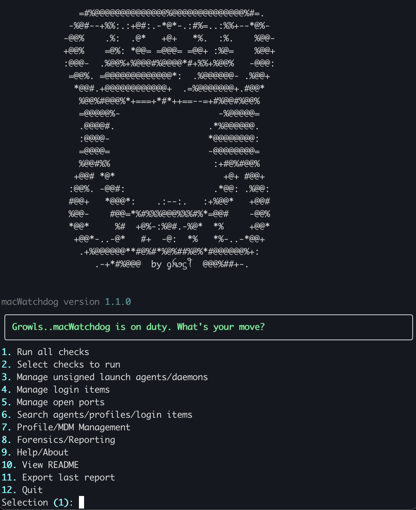

# macWatchdog

Privacy-focused macOS CLI tool to audit and manage security, privacy, MDM enrollment, remote access, and configuration profiles.
Gain visibility and control over what's active on your Mac—whether you're a general user, power user, or IT professional.

[MIT License](./LICENSE) | Python 3.8+ | macOS

## Table of Contents
- [Important Note About macOS Privacy Popups](#important-note-about-macos-privacy-popups)
- [Features](#features)
- [Installation](#installation)
- [Uninstallation](#uninstallation)
- [Usage](#usage)
- [Maintenance & Housekeeping](#maintenance--housekeeping)
- [Help / About](#help--about)
- [Requirements](#requirements)
- [License](#license)
- [Screenshots](#screenshots)

## Important Note About macOS Privacy Popups

Some checks (such as Login Items, Accessibility, and Full Disk Access) require your terminal to access system services via AppleScript or direct database queries. On macOS, this may trigger a popup such as:

> "iTerm.app" wants access to control "System Events.app". Allowing control will provide access to documents and data in "System Events.app", and to perform actions within that app.

This is a normal part of macOS's privacy protections (TCC). If you want a full audit, you should click **Allow**. If you click **Don't Allow**, some checks may fail or return incomplete results, but the rest of the tool will still work.

macWatchdog never sends data off your device and is designed to be privacy-first.

## Features
- Audit MDM enrollment, remote access, launch agents/daemons, configuration profiles, USB devices, network interfaces, and more
- Unsigned Launch Agents/Daemons Management: Detect, quarantine, restore, or purge unsigned launch agents/daemons with automatic backup creation
- Login Items Management: View, backup, remove, and restore login items with automatic backup creation
- Port Management: Monitor open ports, create backups of port state, and safely close ports with automatic backup creation
- Detect world-writable/suspicious files, unknown admin users, login items, open network listeners, and apps with Accessibility/Full Disk Access
- Profile/MDM Deep Dive: List, flag, and remove user-removable configuration profiles; alert on MDM changes; restore instructions for profiles
- Forensics & Reporting: Export system snapshots, compare snapshots, view a timeline/log of changes, and clear logs/snapshots
- Housekeeping: Easily clear logs, snapshots, and quarantine items from the menu
- Export reports to text or JSON
- Modular, open source, and privacy-first

## Installation

1. **Download the latest release archive** (e.g., `macwatchdog-<version>.zip`). The latest release archive is included in this repository for your convenience.
2. **Run the install script:**

   ```sh
   cd macwatchdog-<version>
   bash install.sh
   ```

   - This will:
     - Unpack the archive to `~/macwatchdog`
     - Create a Python virtual environment in `~/macwatchdog/venv`
     - Install all dependencies into the virtual environment
     - Add a shell alias (`macwatchdog`) to your `~/.zshrc` or `~/.bashrc` for easy access

3. **Restart your terminal** (or run `source ~/.zshrc` or `source ~/.bashrc` as appropriate).

4. **Run macWatchdog from anywhere:**

   ```sh
   macwatchdog
   ```

   This will launch the interactive CLI menu. If you prefer, you can also run the tool directly with:
   ```sh
   python3 ~/macwatchdog/CLI/main.py
   ```

## Uninstallation

To fully remove macWatchdog, its data, and the shell alias:

```sh
cd macwatchdog-<version>
bash uninstall.sh
```

- This will remove the install directory (`~/macwatchdog`), the shell alias, and any logs, quarantine, or snapshot files created by the tool.
- You may want to restart your terminal session after uninstalling.

## Usage

### Interactive Menu

Run the interactive menu (after install):

```sh
macwatchdog
```

You will see a menu with options to run all checks, select specific checks, manage unsigned launch agents/daemons, manage login items, manage open ports, search for items, manage profiles/MDM, use forensics/reporting tools, export reports, view help/about, and view the README.

### Command-Line Options

Run all checks directly:

```sh
macwatchdog check --all
```

Run specific checks (by number):

```sh
macwatchdog check --checks 1,3,5
```

Export the last report from the menu to a text or JSON file.

### Unsigned Launch Agents/Daemons Management

The unsigned launch agents/daemons management feature allows you to:
- View all unsigned launch agents and daemons currently on your system
- Quarantine selected or all unsigned agents/daemons (creates automatic backups)
- View quarantined agents/daemons with their backup timestamps
- Restore quarantined agents/daemons to their original locations
- Purge all quarantined items when no longer needed

This feature helps identify and manage potentially suspicious or unwanted launch agents and daemons that aren't properly signed.

### Login Items Management

The login items management feature allows you to:
- View all current login items with their details (name, path, type)
- Create backups of login items before making changes
- Remove login items with automatic backup creation
- Restore login items from backups
- Delete old backups when no longer needed

### Port Management

The port management feature allows you to:
- View all currently open ports and their associated processes
- Create backups of the current port state (useful for auditing and documentation)
- Safely close ports with automatic backup creation
- View backup details and manage backup files

Note: While the tool can create backups of port state, it does not attempt to restore processes as this would require specific process arguments and configurations that vary by application.

### Search Functionality

The search feature allows you to:
- Search for agents, profiles, login items, or files by keyword
- View detailed information about found items
- Take actions on found items (disable/quarantine, restore)
- Search across multiple locations including:
  - Launch agents/daemons
  - Configuration profiles
  - Login items
  - Quarantined items

## Maintenance & Housekeeping

- **Clear Timeline/Log:** Use the Forensics & Reporting menu to clear the forensic timeline/log.
- **Clear Snapshots:** Use the Forensics & Reporting menu to delete all saved snapshots.
- **Purge Quarantine:** Use the Manage Unsigned Launch Agents/Daemons menu to permanently delete all quarantined items.
- **Delete Backups:** Use the respective management menus to delete old backups of login items and port states.
- **Uninstall:** Use the uninstall command to completely remove macWatchdog and all its data.

## Help / About

- Access the Help/About menu from the interactive CLI for a summary of features, privacy notes, and usage tips.
- View the README from the menu for full documentation.
- For version info, run:
  ```sh
  macwatchdog version
  ```

## Requirements
- Python 3.8+
- macOS (tested on recent versions)
- Run with `sudo` for full results (some checks require admin privileges)

## License

This project is open source and available under the [MIT License](./LICENSE).

## Screenshots

### Initial View


### Select Checks Menu
 